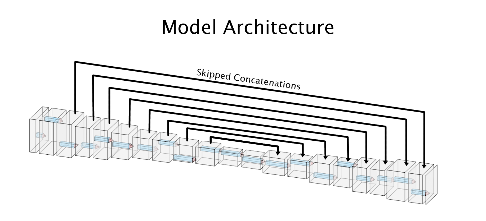
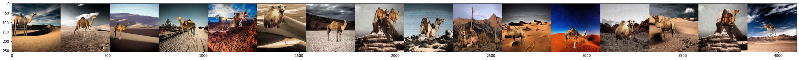
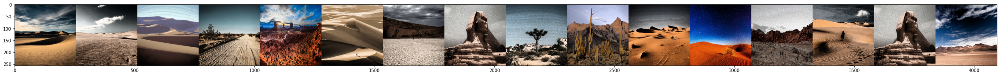
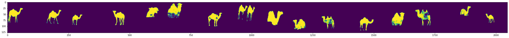
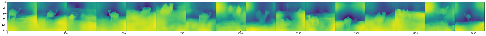

[](https://gitpod.io/#https://github.com/siva-sankar-a/eva_final_project) 

# EVA Final Project
EVA4 final project repository

## Problem statement 
The problem statement is to identify camels from a desert environment

## Dataset creation
Dataset creation was divided into 4 main steps

- Collection of foreground images


- Collection of background images 
    - 100 images of desert background were used

- Creating mask images


## Monocular depth mapping

- Creating depth images


Creating depth maps were tried with 224 X 224 image size and satisfactory results were not obtained


Image size was increased to 1024 X 1024 to obtain better depth images


- Steps for disparity map creation :-
    - Images with different backgrounds were equalized for brightness with [Adaptive Histogram Equalization](https://docs.opencv.org/master/d5/daf/tutorial_py_histogram_equalization.html)
    - Foregrounds were randomly placed and sized between 320 X 320 and 640 X 640 resolution on the 1024 X 1024 background 

## Dataset URLs

The dataset consists of a total of 40000 fg-bg images, bg images, depth maps and masks.

It can be found in the below urls:

- [Background Images](https://eva-final-project-dataset.s3-ap-southeast-2.amazonaws.com/bg_cropped.zip)
- Foregrgound Background Images, Depth Maps and Masks
  - [Part 1](https://eva-final-project-dataset.s3-ap-southeast-2.amazonaws.com/dataset_0.zip)
  - [Part 2](https://eva-final-project-dataset.s3-ap-southeast-2.amazonaws.com/dataset_1.zip)
  - [Part 3](https://eva-final-project-dataset.s3-ap-southeast-2.amazonaws.com/dataset_2.zip)
  - [Part 4](https://eva-final-project-dataset.s3-ap-southeast-2.amazonaws.com/dataset_3.zip)
  - [Part 5](https://eva-final-project-dataset.s3-ap-southeast-2.amazonaws.com/dataset_4.zip)
  - [Part 6](https://eva-final-project-dataset.s3-ap-southeast-2.amazonaws.com/dataset_5.zip)
  - [Part 7](https://eva-final-project-dataset.s3-ap-southeast-2.amazonaws.com/dataset_6.zip)
  - [Part 8](https://eva-final-project-dataset.s3-ap-southeast-2.amazonaws.com/dataset_7.zip)
  - [Part 9](https://eva-final-project-dataset.s3-ap-southeast-2.amazonaws.com/dataset_8.zip)
  - [Part 10](https://eva-final-project-dataset.s3-ap-southeast-2.amazonaws.com/dataset_9.zip)
- [Dataset information file](https://eva-final-project-dataset.s3-ap-southeast-2.amazonaws.com/dataset_info.csv)

## Dataset metrics

| Image Type | Size |  No of channels |  Mean_R | Mean_G | Mean_B | Mean | Std_R | Std_G | Std_B | Std |
| --- | --- | --- | --- | --- | --- |--- | --- | --- | --- | --- | 
| FG - BG Images  | 1024 X 1024 | 3  | 0.4561 | 0.3984 | 0.3620 | NA | 0.2866 | 0.2640 | 0.2774 | NA |
| BG Images  | 1024 X 1024 | 3  | 0.5869 | 0.5174 | 0.4732 | NA | 0.2560 | 0.2398 | 0.2781 | NA |
| Depth Maps | 512 X 512 |1 | NA | NA | NA | 0.0903 |  NA | NA | NA | 0.2781 |
| Masks | 1024 X 1024 | 1 | NA | NA | NA | 0.6289 | NA | NA | NA | 0.2238 |

## Modelling
### Data Augmentation
The following data augmentations were performed:
- Mean
- Normalization
- Adaptive Histogram Equalization (CLAHE)

### Data Model
#### Backbone
The inspiration for the data model was U-NET, a Convolutional Neural Network architecture used in biomedical image segmentation.  This architecture was modified by removing the last upsampling layer, with 12 convolutional layers for downsampling and 8 convolutional layers for upsampling. 


#### Head
The architecture comprises two heads - one for depth prediction and one for mask prediction. It consists of a single convolutional layer.

#### No of parameters
```
Total params: 5,649,664
Trainable params: 5,649,664
Non-trainable params: 0
----------------------------------------------------------------
Input size (MB): 6.00
Forward/backward pass size (MB): 1555.50
Params size (MB): 21.55
Estimated Total Size (MB): 1583.05
----------------------------------------------------------------
```

## Training
There was a total of 400K images in the dataset for BG, FG-BG, depth and mask. A subset of 40,000 images was taken from this dataset for training. 75% of this dataset was used for training and the remaining 25% for testing.
- Size of image in the actual dataset: 1024x1024
- Input image dimension after downsizing for training: 256x256
- Number of channels for input image: 6 (3 each for BG and FG-BG)
- Output image dimension: 128x128
- Number of channels for output image: 2 (1 for Mask and 1 for Depth Map)
- Adam optimizer was used along with a starting learning rate of .

### Loss Function
A custom loss function was developed. It consists of two main components:
- Mask Loss: Binary Cross Entropy Loss


- Depth Loss: Combination of SSIM Loss and L1 Loss given by:


- Total loss: Sum of Mask Loss and Depth Loss


- The constants were empherically found for training as follows

| Constant | Value |
| -- | -- | 
|  |  |
|  |  |
|  |  |


### Accuracy
Two accuracies are computed for evaluating the model:
- Mask Accuracy: Computed as the average number of correct pixels predicted against the target mask.
- Depth Accuracy: Computed as SSIM between the predicted and target mask.

## Results

The last 






## Lessons learnt
- Depth mapping not effective due to excessive shadows and occlusions in background
- Reconsidering background image setup
- Depth mapping prediction gives unsatisfactory results for small image of size 224, 224 