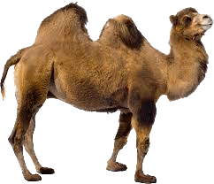
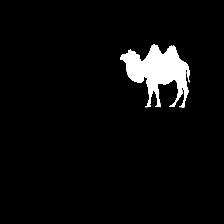
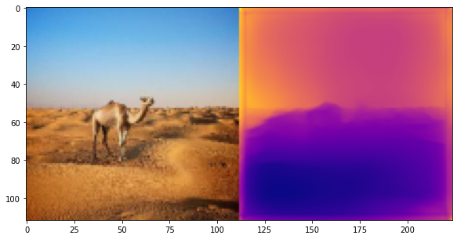
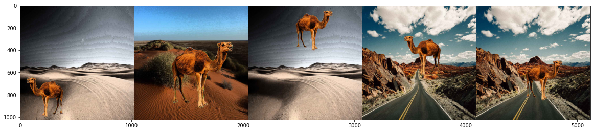
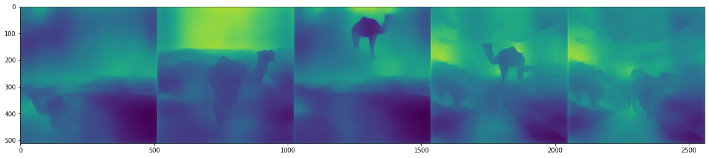

 

# EVA Final Project
EVA4 final project repository

# Problem statement 
The problem statement is to identify camels from a desert environment

## Dataset creation
Dataset creation was divided into 4 main steps

- Collection of foreground images

- Collection of background images 
    - 100 images of desert background were used

- Creating mask images

## Monocular depth mapping

- Creating depth images

Creating depth maps were tried with 224 X 224 image size and satisfactory results were not obtained

Image size was increased to 1024 X 1024 to obtain better depth images

- Steps for disparity map creation :-
    - Images with different backgrounds were equalized for brightness with [Adaptive Histogram Equalization](https://docs.opencv.org/master/d5/daf/tutorial_py_histogram_equalization.html)
    - Foregrounds were randomly placed and sized between 320 X 320 and 640 X 640 resolution on the 1024 X 1024 background 

# Lessons learnt

- Depth mapping not effective due to excessive shadows and occlusions in background
- Reconsidering background image setup
- Depth mapping prediction gives unsatisfactory results for small image of size 224, 224 